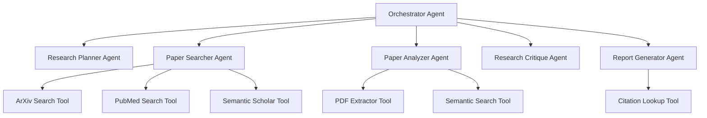

# 🔬 The Autonomous Research Agent

**A collaborative multi-agent AI system that automates comprehensive literature reviews to accelerate scientific innovation, built on AWS Strands Agents and Amazon Bedrock.**


---

### **Table of Contents**

1.  [Introduction: The Problem & Our Solution](#1-introduction-the-problem--our-solution)
2.  [Key Features & Requirements](#2-key-features--requirements)
3.  [The Glass Box: Real-time Transparency](#3-the-glass-box-real-time-transparency)
4.  [How It Works: The Multi-Agent Architecture](#4-how-it-works-the-multi-agent-architecture)
5.  [Technology Stack](#5-technology-stack)
6.  [Project Setup & Local Development (Copilot Instructions)](#6-project-setup--local-development-copilot-instructions)
7.  [Deployment Steps (Copilot Instructions)](#7-deployment-steps-copilot-instructions)
8.  [Running a Research Task](#8-running-a-research-task)
9.  [Directory Structure](#9-directory-structure)
10. [Live Demo & Video](#10-live-demo--video)
11. [Team](#11-team)

---

## **1. Introduction: The Problem & Our Solution**

The exponential growth of scientific literature presents a formidable challenge to researchers. Conducting a thorough literature review, a foundational step for any scientific endeavor, has become a months-long, labor-intensive manual effort. This bottleneck significantly impedes the pace of innovation, increases the risk of redundant work, and obscures crucial cross-disciplinary insights.

Our solution, **The Autonomous Research Agent**, is designed to revolutionize this process. It's a sophisticated, collaborative multi-agent AI system built on **AWS Strands Agents SDK** and **Amazon Bedrock**. Researchers can provide a high-level query (e.g., "Summarize recent advances in mRNA vaccine stabilization techniques"), and the system will autonomously:
* Formulate a research plan.
* Search multiple academic databases.
* Analyze and synthesize findings from relevant papers.
* Critique its own analysis for completeness and accuracy.
* Generate a comprehensive, properly cited research report, all within minutes.

This system aims to transform the tedious literature review into an automated, transparent, and academically rigorous workflow, accelerating scientific discovery.

## **2. Key Features & Requirements**

This project addresses key requirements for autonomous research, focusing on both the research outcome and the user experience:

* **Autonomous & Comprehensive Research (Req 1, 3):**
    * Submits a query, receives a full literature review automatically.
    * Generates structured research plans and makes reasonable assumptions for ambiguous queries.
    * Queries multiple academic databases (arXiv, PubMed, Semantic Scholar) and analyzes full-text content.
    * Filters irrelevant papers and identifies key methodologies, novel contributions, and comparative insights.
* **Self-Critique & Iterative Refinement (Req 4):**
    * Automatically critiques its own analysis for completeness and accuracy.
    * Conducts additional research to fill identified gaps and revises analysis until quality standards are met.
* **Verifiable & Professional Reports (Req 5):**
    * Generates well-structured reports including executive summary, methodology review, comparative analysis, and future directions.
    * Provides proper academic citations with links to original papers.
    * Reports are stored in a downloadable Markdown format with metadata on the research process.
* **Scalable, Resilient & Cost-Optimized (Req 6, 7):**
    * Fully serverless AWS architecture, scaling automatically for concurrent research sessions.
    * Maintains state persistence for long-running tasks, recovering from failures.
    * Caches processed content (e.g., extracted PDF text) for faster, cost-effective reuse.
    * Scales down to zero when idle to minimize costs.
* **Secure & Private (Req 8):**
    * Encrypts all data at rest and in transit.
    * Uses secure access controls (e.g., presigned URLs) and implements authentication/authorization.
    * Maintains session-based data isolation with automatic cache expiration.

## **3. The Glass Box: Real-time Transparency (Req 2)**

A cornerstone of our design is the **"Glass Box" transparency system**. As a researcher, you'll have real-time visibility into every thought and action of the AI agents.

* **Live Activity Stream:** See a timeline of all agent activities directly in the frontend.
* **Reasoning Display:** Understand *why* an agent made a particular decision or chose a specific tool.
* **Tool Invocation Details:** View which deterministic tools are being called, their input parameters, and their raw results.
* **Complete Audit Trail:** A full record of the agent's workflow is preserved, building trust and enabling verification.

This "Glass Box" is powered by **AWS SNS** and **API Gateway WebSockets**, streaming events from the backend to the frontend.

## **4. How It Works: The Multi-Agent Architecture**

Our system employs a sophisticated **hierarchical multi-agent architecture** managed by **AWS Strands Agents SDK**.



**Key Architectural Principles:**

* **Orchestrator Agent (The Research Lead):** This primary agent, powered by Claude 3.5 Sonnet, receives user queries. It acts as a project manager, dynamically delegating tasks to specialist agents, managing the overall workflow, and handling feedback loops (e.g., from the Critique Agent). It uses specialist agents as "intelligent tools" via the Strands A2A (Agent-to-Agent) protocol.

* **Specialist Agents (The Experts):** Five dedicated agents, each with its own Claude 3.5 Sonnet LLM and system prompt, possess distinct domain expertise:
    * **Research Planner Agent:** Develops the research strategy and search plan.
    * **Paper Searcher Agent:** Executes searches across academic databases, refining queries intelligently.
    * **Paper Analyzer Agent:** Performs deep technical analysis of paper content.
    * **Research Critique Agent:** Acts as quality assurance, evaluating completeness and accuracy, requesting revisions.
    * **Report Generator Agent:** Compiles findings into the final, structured report.

* **Deterministic Tools (The Reliable Workers):** These are serverless AWS Lambda functions that perform specific, reliable tasks without reasoning. Agents choose when and how to invoke these tools. Examples include `arxiv_search_tool`, `pdf_text_extractor`, `semantic_search_tool`, and `citation_lookup_tool`. Each tool is a separate Lambda for isolation and independent scaling.

* **Serverless Backbone:** All components—including agent runtimes, tools, storage, APIs, and messaging—are implemented using fully managed AWS serverless services (AWS Lambda, DynamoDB, S3, API Gateway, SNS, Bedrock AgentCore), ensuring maximum scalability, resilience, and cost-efficiency.

## **5. Technology Stack**

- **AI & Orchestration:** AWS Strands Agents SDK (v1.0+), Amazon Bedrock AgentCore
- **Foundation Model:** Anthropic Claude 3.5 Sonnet (via Amazon Bedrock)
- **Embeddings:** Amazon Titan Embeddings V2 (via Amazon Bedrock)
- **Backend Compute:** AWS Lambda (Python 3.11)
- **Data Storage:** Amazon DynamoDB (Research Tasks, WebSocket Connections), Amazon S3 (Cache Bucket, Reports Bucket)
- **API Layer:** Amazon API Gateway (REST API for requests, WebSocket API for real-time updates)
- **Messaging:** Amazon SNS (Agent event stream)
- **Frontend:** React, Vite, Ant Design (for UI components), Tailwind CSS
- **Infrastructure as Code:** AWS CDK (Cloud Development Kit)
- **Monitoring & Observability:** Amazon CloudWatch, AWS X-Ray, Bedrock AgentCore Observability Service

## **6. Project Setup & Local Development (Copilot Instructions)**

This section guides you (and Copilot!) through setting up the project locally for development and testing.

### **6.1. Prerequisites (Check these first)**

- **AWS Account & AWS CLI:** Configured with credentials and sufficient permissions to deploy Bedrock, Lambda, DynamoDB, S3, API Gateway, SNS.
  - **Copilot Instruction:** Verify `aws configure` is set up and `aws sts get-caller-identity` returns your user/role.
- **Bedrock Model Access:** Ensure your AWS account has access to `anthropic.claude-3-5-sonnet-v1` and `amazon.titan-embed-text-v2` in the Bedrock console.
  - **Copilot Instruction:** If access is not granted, guide the user to request it in the Bedrock service settings.
- **Python 3.11+ & Pip:**
  - **Copilot Instruction:** Verify `python --version` and `pip --version`.
- **Node.js 18+ & npm:**
  - **Copilot Instruction:** Verify `node --version` and `npm --version`.
- **AWS CDK CLI:**
  - **Copilot Instruction:** Verify `cdk --version`. If not installed, suggest `npm install -g aws-cdk`.

### **6.2. Backend Setup (Copilot, follow these steps!)**

1. **Create Lambda Layer for Dependencies:**
   - **Copilot Instruction:** Navigate to the project root. Create the directory `layers/dependencies/python`.
   - **Copilot Instruction:** Install core Python dependencies into the layer: `pip install strands-agents boto3 arxiv PyPDF2 requests simplejson python-dotenv -t layers/dependencies/python`.
   - **Copilot Instruction:** Ensure `layers/dependencies/python` contains the installed packages.

2. **Initialize AWS CDK:**
   - **Copilot Instruction:** Navigate to the `cdk` directory.
   - **Copilot Instruction:** If this is the first time using CDK in this account/region, run `cdk bootstrap aws://YOUR_AWS_ACCOUNT_ID/YOUR_AWS_REGION` (replace placeholders).

3. **Synthesize CDK Templates:**
   - **Copilot Instruction:** From the `cdk` directory, run `cdk synth` to generate CloudFormation templates. Review the output for any errors.

4. **Local Testing of Agent Logic (before full AWS deployment):**
   - **Copilot Instruction:** In `src/main_agent_handler.py`, temporarily set `self.memory_service` and `self.observer` to simple in-memory objects or mocks if `bedrock_agentcore` requires deployed services.
   - **Copilot Instruction:** Create a temporary `src/run_local_test.py` file with code to instantiate `ResearchAgentSystem` and call `process_research_request` with a sample query, e.g., `asyncio.run(agent_system.process_research_request("Explain Tree of Thoughts prompting.", "local_test_session"))`.
   - **Copilot Instruction:** Run `python src/run_local_test.py` and verify agent thoughts and tool calls are printed to the console.
   - **Copilot Instruction:** Remove `src/run_local_test.py` after verification.

### **6.3. Frontend Setup (Copilot, follow these steps!)**

1. **Navigate to Frontend Directory:**
   - **Copilot Instruction:** `cd frontend/`

2. **Install Dependencies:**
   - **Copilot Instruction:** `npm install`

3. **Configure API Endpoints:**
   - **Copilot Instruction:** Create a `.env.local` file in the frontend directory.
   - **Copilot Instruction:** Once the backend is deployed (see Section 7), populate `.env.local` with the actual API Gateway URLs. For now, use placeholders: `VITE_API_REST_URL=YOUR_REST_API_GATEWAY_URL` and `VITE_API_WS_URL=YOUR_WEB_SOCKET_API_GATEWAY_URL`.

4. **Run Local Development Server:**
   - **Copilot Instruction:** `npm run dev`
   - **Copilot Instruction:** The application will be available at `http://localhost:5173`. Expect some backend connectivity errors until deployment.

## **7. Deployment Steps (Copilot Instructions)**

This section provides instructions to deploy the entire Autonomous Research Agent system to your AWS account.

### **7.1. Deploy Backend Infrastructure**

1. **Ensure CDK Bootstrap:**
   - **Copilot Instruction:** Verify CDK has been bootstrapped for your account/region (see 6.2 Backend Setup step 2).

2. **Deploy the Stack:**
   - **Copilot Instruction:** Navigate to the `cdk` directory.
   - **Copilot Instruction:** Run `cdk deploy ResearchAgentStack --all --require-approval never`.
   - **Copilot Instruction:** Note down the outputs, especially `ResearchApiEndpoint` and `WebSocketApiEndpoint` as these will be needed for the frontend.

### **7.2. Deploy Frontend to S3/CloudFront**

1. **Build Frontend:**
   - **Copilot Instruction:** Navigate to the `frontend` directory.
   - **Copilot Instruction:** Run `npm run build`.

2. **Deploy to S3:**
   - **Copilot Instruction:** Update the `frontend_s3_bucket_name` in your `cdk/research_agent_stack.py` to match an S3 bucket name created during `cdk deploy` (e.g., `research-agent-frontend-bucket-<random-suffix>`).
   - **Copilot Instruction:** Run `aws s3 sync build/ s3://YOUR_FRONTEND_S3_BUCKET_NAME --delete` (replace `YOUR_FRONTEND_S3_BUCKET_NAME`).
   - **Copilot Instruction:** Once deployed, locate the CloudFront distribution URL associated with your frontend bucket for accessing the application.

## **8. Running a Research Task**

1. **Access Frontend:** Open your deployed frontend application via the CloudFront URL.
2. **Submit Query:** Enter a research query in the input field, e.g., "Summarize recent advances in quantum computing architectures and their error correction mechanisms."
3. **Observe Glass Box:** Watch the real-time timeline display the agents' thoughts, tool calls, and results.
4. **Review Report:** Once complete, the final report will be displayed and available for download.

## **9. Directory Structure**

```
.
├── .github/                       # GitHub Actions workflows, etc. (if applicable)
├── .vscode/                       # VS Code settings
├── cdk/                           # AWS CDK Infrastructure as Code
│   └── research_agent_stack.py    # Defines all AWS resources
├── layers/                        # Lambda Layers for shared dependencies
│   └── dependencies/
│       └── python/                # Python packages (Strands SDK, boto3, arxiv, PyPDF2 etc.)
├── src/                           # Backend Python source code
│   ├── main_agent_handler.py      # Contains ResearchAgentSystem, all Strands agent definitions
│   ├── lambda_handler.py          # Main AWS Lambda handler for REST/WebSocket events
│   ├── websocket_handler.py       # Lambda for SNS-to-WebSocket relay
│   └── tools/                     # Deterministic tools implementations
│       ├── __init__.py
│       └── deterministic_tools.py # @tool decorated functions (e.g., arxiv_search_tool, pdf_text_extractor, semantic_search_tool, citation_lookup_tool)
├── frontend/                      # React frontend application
│   ├── public/
│   ├── src/
│   │   ├── components/
│   │   │   └── GlassBox.tsx       # React component for real-time visualization
│   │   ├── App.tsx
│   │   └── index.tsx
│   ├── package.json
│   └── vite.config.ts
├── assets/                        # Images, diagrams, etc.
│   └── architecture.png           # System architecture diagram
├── .gitignore
├── README.md                      # Project README
├── requirements.txt               # Top-level Python dependencies for local env (optional, layers are preferred)
└── LICENSE
```

## **10. Live Demo & Video**

- **Deployed Project URL:** [LINK TO YOUR DEPLOYED WEBSITE]
- **Demo Video:** [LINK TO YOUR 3-MINUTE DEMO VIDEO]

## **11. Team**

- **Prathamesh More**
- **Yash Panchal**
